# [📈 Live Status](https://uptimereports.github.io/iwebup): <!--live status--> **🟩 All systems operational**

This repository contains the open-source uptime monitor and status page for [uptimereports](https://uptimereports.github.io/iwebup), powered by [Upptime](https://github.com/upptime/upptime).

With [Upptime](https://upptime.js.org), you can get your own unlimited and free uptime monitor and status page, powered entirely by a GitHub repository. We use [Issues](https://github.com/uptimereports/iwebup/issues) as incident reports, [Actions](https://github.com/uptimereports/iwebup/actions) as uptime monitors, and [Pages](https://uptimereports.github.io/iwebup) for the status page.

<!--start: status pages-->
<!-- This summary is generated by Upptime (https://github.com/upptime/upptime) -->
<!-- Do not edit this manually, your changes will be overwritten -->
<!-- prettier-ignore -->
| URL | Status | History | Response Time | Uptime |
| --- | ------ | ------- | ------------- | ------ |
|  [3guyslocksmiths.com](https://3guyslocksmiths.com) | 🟩 Up | [3guyslocksmiths-com.yml](https://github.com/uptimereports/iwebup/commits/HEAD/history/3guyslocksmiths-com.yml) | 

 2256ms
     
 | 

<a href="https://uptimereports.github.io/iwebup/history/3guyslocksmiths-com">99.82%</a>
    

|  [a1handymanfl.com](https://a1handymanfl.com) | 🟩 Up | [a1handymanfl-com.yml](https://github.com/uptimereports/iwebup/commits/HEAD/history/a1handymanfl-com.yml) | 

 2015ms
     
 | 

<a href="https://uptimereports.github.io/iwebup/history/a1handymanfl-com">99.82%</a>
    

|  [aarclibrary.org](https://aarclibrary.org) | 🟩 Up | [aarclibrary-org.yml](https://github.com/uptimereports/iwebup/commits/HEAD/history/aarclibrary-org.yml) | 

 2834ms
     
 | 

<a href="https://uptimereports.github.io/iwebup/history/aarclibrary-org">99.82%</a>
    

|  [abhomecurators.com](https://abhomecurators.com) | 🟩 Up | [abhomecurators-com.yml](https://github.com/uptimereports/iwebup/commits/HEAD/history/abhomecurators-com.yml) | 

 2307ms
     
 | 

<a href="https://uptimereports.github.io/iwebup/history/abhomecurators-com">99.33%</a>
    

|  [acorntwa.com](https://acorntwa.com) | 🟩 Up | [acorntwa-com.yml](https://github.com/uptimereports/iwebup/commits/HEAD/history/acorntwa-com.yml) | 

 2711ms
     
 | 

<a href="https://uptimereports.github.io/iwebup/history/acorntwa-com">99.82%</a>
    

|  [affordabledivorcedocuments.com](https://affordabledivorcedocuments.com) | 🟩 Up | [affordabledivorcedocuments-com.yml](https://github.com/uptimereports/iwebup/commits/HEAD/history/affordabledivorcedocuments-com.yml) | 

 4263ms
     
 | 

<a href="https://uptimereports.github.io/iwebup/history/affordabledivorcedocuments-com">99.82%</a>
    

|  [andrewkreig.com](https://andrewkreig.com) | 🟩 Up | [andrewkreig-com.yml](https://github.com/uptimereports/iwebup/commits/HEAD/history/andrewkreig-com.yml) | 

 365ms
     
 | 

<a href="https://uptimereports.github.io/iwebup/history/andrewkreig-com">95.12%</a>
    

|  [angelmaidscm.com](https://angelmaidscm.com) | 🟩 Up | [angelmaidscm-com.yml](https://github.com/uptimereports/iwebup/commits/HEAD/history/angelmaidscm-com.yml) | 

 2338ms
     
 | 

<a href="https://uptimereports.github.io/iwebup/history/angelmaidscm-com">99.82%</a>
    

|  [astrologytalk.com](https://astrologytalk.com) | 🟩 Up | [astrologytalk-com.yml](https://github.com/uptimereports/iwebup/commits/HEAD/history/astrologytalk-com.yml) | 

 2853ms
     
 | 

<a href="https://uptimereports.github.io/iwebup/history/astrologytalk-com">100.00%</a>
    

|  [atreasuredmemoryphotography.com](https://atreasuredmemoryphotography.com) | 🟩 Up | [atreasuredmemoryphotography-com.yml](https://github.com/uptimereports/iwebup/commits/HEAD/history/atreasuredmemoryphotography-com.yml) | 

 2310ms
     
 | 

<a href="https://uptimereports.github.io/iwebup/history/atreasuredmemoryphotography-com">99.82%</a>
    

|  [berkinsville.com](https://berkinsville.com) | 🟩 Up | [berkinsville-com.yml](https://github.com/uptimereports/iwebup/commits/HEAD/history/berkinsville-com.yml) | 

 2994ms
     
 | 

<a href="https://uptimereports.github.io/iwebup/history/berkinsville-com">100.00%</a>
    

|  [blulumenpro.com](https://blulumenpro.com) | 🟩 Up | [blulumenpro-com.yml](https://github.com/uptimereports/iwebup/commits/HEAD/history/blulumenpro-com.yml) | 

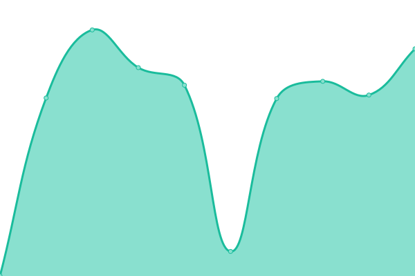 1774ms
     
 | 

<a href="https://uptimereports.github.io/iwebup/history/blulumenpro-com">99.82%</a>
    

|  [buildcolumbiacounty.com](https://buildcolumbiacounty.com) | 🟩 Up | [buildcolumbiacounty-com.yml](https://github.com/uptimereports/iwebup/commits/HEAD/history/buildcolumbiacounty-com.yml) | 

 2489ms
     
 | 

<a href="https://uptimereports.github.io/iwebup/history/buildcolumbiacounty-com">99.82%</a>
    

|  [canvaslandsurveying.com](https://canvaslandsurveying.com) | 🟩 Up | [canvaslandsurveying-com.yml](https://github.com/uptimereports/iwebup/commits/HEAD/history/canvaslandsurveying-com.yml) | 

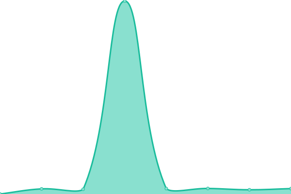 341ms
     
 | 

<a href="https://uptimereports.github.io/iwebup/history/canvaslandsurveying-com">100.00%</a>
    

|  [capa-us.org](https://capa-us.org) | 🟩 Up | [capa-us-org.yml](https://github.com/uptimereports/iwebup/commits/HEAD/history/capa-us-org.yml) | 

 427ms
     
 | 

<a href="https://uptimereports.github.io/iwebup/history/capa-us-org">100.00%</a>
    

|  [chainreactionfence.com](https://chainreactionfence.com) | 🟩 Up | [chainreactionfence-com.yml](https://github.com/uptimereports/iwebup/commits/HEAD/history/chainreactionfence-com.yml) | 

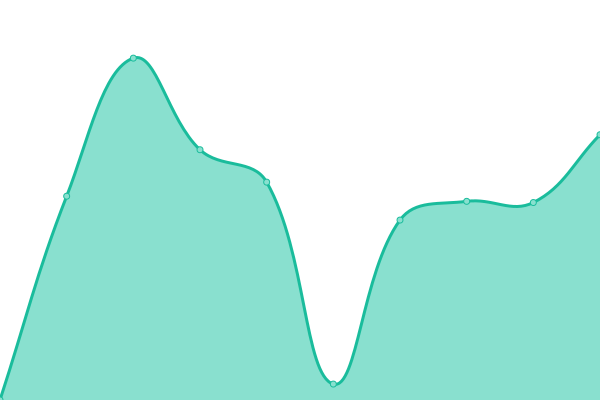 2652ms
     
 | 

<a href="https://uptimereports.github.io/iwebup/history/chainreactionfence-com">99.82%</a>
    

|  [chiappinifarm.com](https://chiappinifarm.com) | 🟩 Up | [chiappinifarm-com.yml](https://github.com/uptimereports/iwebup/commits/HEAD/history/chiappinifarm-com.yml) | 

 475ms
     
 | 

<a href="https://uptimereports.github.io/iwebup/history/chiappinifarm-com">100.00%</a>
    

|  [codered2014.com](https://codered2014.com) | 🟩 Up | [codered2014-com.yml](https://github.com/uptimereports/iwebup/commits/HEAD/history/codered2014-com.yml) | 

 2973ms
     
 | 

<a href="https://uptimereports.github.io/iwebup/history/codered2014-com">99.82%</a>
    

|  [dianewilliamsdoyle.com](https://dianewilliamsdoyle.com) | 🟩 Up | [dianewilliamsdoyle-com.yml](https://github.com/uptimereports/iwebup/commits/HEAD/history/dianewilliamsdoyle-com.yml) | 

 2111ms
     
 | 

<a href="https://uptimereports.github.io/iwebup/history/dianewilliamsdoyle-com">99.39%</a>
    

|  [dignityroasters.com](https://dignityroasters.com) | 🟩 Up | [dignityroasters-com.yml](https://github.com/uptimereports/iwebup/commits/HEAD/history/dignityroasters-com.yml) | 

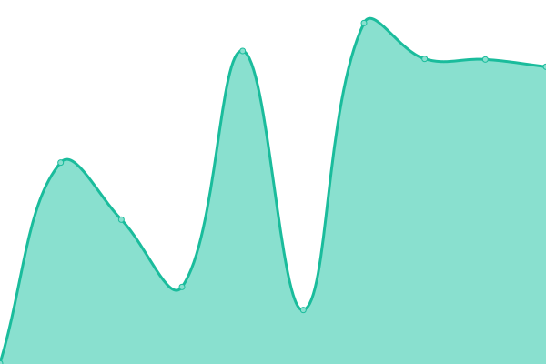 464ms
     
 | 

<a href="https://uptimereports.github.io/iwebup/history/dignityroasters-com">100.00%</a>
    

|  [dogobediencedaytonabeach.com](https://dogobediencedaytonabeach.com) | 🟩 Up | [dogobediencedaytonabeach-com.yml](https://github.com/uptimereports/iwebup/commits/HEAD/history/dogobediencedaytonabeach-com.yml) | 

 3285ms
     
 | 

<a href="https://uptimereports.github.io/iwebup/history/dogobediencedaytonabeach-com">99.39%</a>
    

|  [environmental-law.net](https://environmental-law.net) | 🟩 Up | [environmental-law-net.yml](https://github.com/uptimereports/iwebup/commits/HEAD/history/environmental-law-net.yml) | 

 2063ms
     
 | 

<a href="https://uptimereports.github.io/iwebup/history/environmental-law-net">99.82%</a>
    

|  [epcspaces.com](https://epcspaces.com) | 🟩 Up | [epcspaces-com.yml](https://github.com/uptimereports/iwebup/commits/HEAD/history/epcspaces-com.yml) | 

 1834ms
     
 | 

<a href="https://uptimereports.github.io/iwebup/history/epcspaces-com">99.40%</a>
    

|  [faaeh.com](https://faaeh.com) | 🟩 Up | [faaeh-com.yml](https://github.com/uptimereports/iwebup/commits/HEAD/history/faaeh-com.yml) | 

 4510ms
     
 | 

<a href="https://uptimereports.github.io/iwebup/history/faaeh-com">31.96%</a>
    

|  [farrillsac.com](https://farrillsac.com) | 🟩 Up | [farrillsac-com.yml](https://github.com/uptimereports/iwebup/commits/HEAD/history/farrillsac-com.yml) | 

 2448ms
     
 | 

<a href="https://uptimereports.github.io/iwebup/history/farrillsac-com">99.82%</a>
    

|  [fencingnearmemiami.com](https://fencingnearmemiami.com) | 🟩 Up | [fencingnearmemiami-com.yml](https://github.com/uptimereports/iwebup/commits/HEAD/history/fencingnearmemiami-com.yml) | 

 1751ms
     
 | 

<a href="https://uptimereports.github.io/iwebup/history/fencingnearmemiami-com">99.82%</a>
    

|  [firstlightinsite.com](https://firstlightinsite.com) | 🟩 Up | [firstlightinsite-com.yml](https://github.com/uptimereports/iwebup/commits/HEAD/history/firstlightinsite-com.yml) | 

 592ms
     
 | 

<a href="https://uptimereports.github.io/iwebup/history/firstlightinsite-com">100.00%</a>
    

|  [flashlocksmithus.com](https://flashlocksmithus.com) | 🟩 Up | [flashlocksmithus-com.yml](https://github.com/uptimereports/iwebup/commits/HEAD/history/flashlocksmithus-com.yml) | 

 2626ms
     
 | 

<a href="https://uptimereports.github.io/iwebup/history/flashlocksmithus-com">99.82%</a>
    

|  [flbhimpact.org](https://flbhimpact.org) | 🟩 Up | [flbhimpact-org.yml](https://github.com/uptimereports/iwebup/commits/HEAD/history/flbhimpact-org.yml) | 

 699ms
     
 | 

<a href="https://uptimereports.github.io/iwebup/history/flbhimpact-org">99.82%</a>
    

|  [flmomsmatter.org](https://flmomsmatter.org) | 🟩 Up | [flmomsmatter-org.yml](https://github.com/uptimereports/iwebup/commits/HEAD/history/flmomsmatter-org.yml) | 

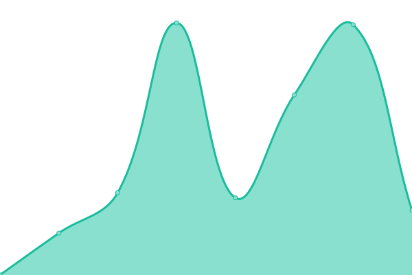 1348ms
     
 | 

<a href="https://uptimereports.github.io/iwebup/history/flmomsmatter-org">99.82%</a>
    

|  [floridainsuranceboutique.com](https://floridainsuranceboutique.com) | 🟩 Up | [floridainsuranceboutique-com.yml](https://github.com/uptimereports/iwebup/commits/HEAD/history/floridainsuranceboutique-com.yml) | 

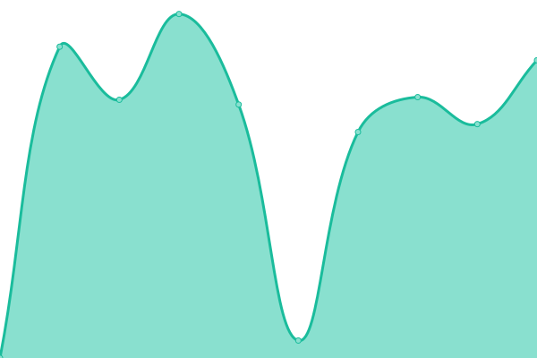 3526ms
     
 | 

<a href="https://uptimereports.github.io/iwebup/history/floridainsuranceboutique-com">99.82%</a>
    

|  [foxfirerealtyschool.com](https://foxfirerealtyschool.com) | 🟩 Up | [foxfirerealtyschool-com.yml](https://github.com/uptimereports/iwebup/commits/HEAD/history/foxfirerealtyschool-com.yml) | 

 391ms
     
 | 

<a href="https://uptimereports.github.io/iwebup/history/foxfirerealtyschool-com">100.00%</a>
    

|  [gainesvillemetalworks.com](https://gainesvillemetalworks.com) | 🟩 Up | [gainesvillemetalworks-com.yml](https://github.com/uptimereports/iwebup/commits/HEAD/history/gainesvillemetalworks-com.yml) | 

 391ms
     
 | 

<a href="https://uptimereports.github.io/iwebup/history/gainesvillemetalworks-com">100.00%</a>
    

|  [giellainsurance.com](https://giellainsurance.com) | 🟩 Up | [giellainsurance-com.yml](https://github.com/uptimereports/iwebup/commits/HEAD/history/giellainsurance-com.yml) | 

 3483ms
     
 | 

<a href="https://uptimereports.github.io/iwebup/history/giellainsurance-com">99.81%</a>
    

|  [givelifecare.org](https://givelifecare.org) | 🟩 Up | [givelifecare-org.yml](https://github.com/uptimereports/iwebup/commits/HEAD/history/givelifecare-org.yml) | 

 462ms
     
 | 

<a href="https://uptimereports.github.io/iwebup/history/givelifecare-org">100.00%</a>
    

|  [godwinins.com](https://godwinins.com) | 🟩 Up | [godwinins-com.yml](https://github.com/uptimereports/iwebup/commits/HEAD/history/godwinins-com.yml) | 

 2364ms
     
 | 

<a href="https://uptimereports.github.io/iwebup/history/godwinins-com">99.81%</a>
    

|  [goodtimeprinting.com](https://goodtimeprinting.com) | 🟩 Up | [goodtimeprinting-com.yml](https://github.com/uptimereports/iwebup/commits/HEAD/history/goodtimeprinting-com.yml) | 

 2984ms
     
 | 

<a href="https://uptimereports.github.io/iwebup/history/goodtimeprinting-com">99.81%</a>
    

|  [griffininsurance.net](https://griffininsurance.net) | 🟩 Up | [griffininsurance-net.yml](https://github.com/uptimereports/iwebup/commits/HEAD/history/griffininsurance-net.yml) | 

 258ms
     
 | 

<a href="https://uptimereports.github.io/iwebup/history/griffininsurance-net">100.00%</a>
    

|  [h2hservices.com](https://h2hservices.com) | 🟩 Up | [h2hservices-com.yml](https://github.com/uptimereports/iwebup/commits/HEAD/history/h2hservices-com.yml) | 

 1946ms
     
 | 

<a href="https://uptimereports.github.io/iwebup/history/h2hservices-com">99.81%</a>
    

|  [homeinspection-palmcoast.com](https://homeinspection-palmcoast.com) | 🟩 Up | [homeinspection-palmcoast-com.yml](https://github.com/uptimereports/iwebup/commits/HEAD/history/homeinspection-palmcoast-com.yml) | 

 2407ms
     
 | 

<a href="https://uptimereports.github.io/iwebup/history/homeinspection-palmcoast-com">99.81%</a>
    

|  [howsgrandma.com](https://howsgrandma.com) | 🟩 Up | [howsgrandma-com.yml](https://github.com/uptimereports/iwebup/commits/HEAD/history/howsgrandma-com.yml) | 

 775ms
     
 | 

<a href="https://uptimereports.github.io/iwebup/history/howsgrandma-com">100.00%</a>
    

|  [hwmtraining.com](https://hwmtraining.com) | 🟩 Up | [hwmtraining-com.yml](https://github.com/uptimereports/iwebup/commits/HEAD/history/hwmtraining-com.yml) | 

 2320ms
     
 | 

<a href="https://uptimereports.github.io/iwebup/history/hwmtraining-com">99.73%</a>
    

|  [indoorairflorida.com](https://indoorairflorida.com) | 🟩 Up | [indoorairflorida-com.yml](https://github.com/uptimereports/iwebup/commits/HEAD/history/indoorairflorida-com.yml) | 

 2294ms
     
 | 

<a href="https://uptimereports.github.io/iwebup/history/indoorairflorida-com">99.81%</a>
    

|  [jandenise.com](https://jandenise.com) | 🟩 Up | [jandenise-com.yml](https://github.com/uptimereports/iwebup/commits/HEAD/history/jandenise-com.yml) | 

 6514ms
     
 | 

<a href="https://uptimereports.github.io/iwebup/history/jandenise-com">33.52%</a>
    

|  [jmnjmu.com](https://jmnjmu.com) | 🟩 Up | [jmnjmu-com.yml](https://github.com/uptimereports/iwebup/commits/HEAD/history/jmnjmu-com.yml) | 

 357ms
     
 | 

<a href="https://uptimereports.github.io/iwebup/history/jmnjmu-com">100.00%</a>
    

|  [joebentivegna.com](https://joebentivegna.com) | 🟩 Up | [joebentivegna-com.yml](https://github.com/uptimereports/iwebup/commits/HEAD/history/joebentivegna-com.yml) | 

 2689ms
     
 | 

<a href="https://uptimereports.github.io/iwebup/history/joebentivegna-com">41.97%</a>
    

|  [kenjonesllc.com](https://kenjonesllc.com) | 🟩 Up | [kenjonesllc-com.yml](https://github.com/uptimereports/iwebup/commits/HEAD/history/kenjonesllc-com.yml) | 

 1608ms
     
 | 

<a href="https://uptimereports.github.io/iwebup/history/kenjonesllc-com">99.81%</a>
    

|  [larrysfencing.com](https://larrysfencing.com) | 🟩 Up | [larrysfencing-com.yml](https://github.com/uptimereports/iwebup/commits/HEAD/history/larrysfencing-com.yml) | 

 1938ms
     
 | 

<a href="https://uptimereports.github.io/iwebup/history/larrysfencing-com">99.81%</a>
    

|  [lbcommercialcleaners.com](https://lbcommercialcleaners.com) | 🟩 Up | [lbcommercialcleaners-com.yml](https://github.com/uptimereports/iwebup/commits/HEAD/history/lbcommercialcleaners-com.yml) | 

 2343ms
     
 | 

<a href="https://uptimereports.github.io/iwebup/history/lbcommercialcleaners-com">99.81%</a>
    

|  [limitlessexteriorsfl.com](https://limitlessexteriorsfl.com) | 🟩 Up | [limitlessexteriorsfl-com.yml](https://github.com/uptimereports/iwebup/commits/HEAD/history/limitlessexteriorsfl-com.yml) | 

 2246ms
     
 | 

<a href="https://uptimereports.github.io/iwebup/history/limitlessexteriorsfl-com">99.81%</a>
    

|  [limitlessfitness6.com](https://limitlessfitness6.com) | 🟩 Up | [limitlessfitness6-com.yml](https://github.com/uptimereports/iwebup/commits/HEAD/history/limitlessfitness6-com.yml) | 

 3379ms
     
 | 

<a href="https://uptimereports.github.io/iwebup/history/limitlessfitness6-com">99.81%</a>
    

|  [livemeaningfully.net](https://livemeaningfully.net) | 🟩 Up | [livemeaningfully-net.yml](https://github.com/uptimereports/iwebup/commits/HEAD/history/livemeaningfully-net.yml) | 

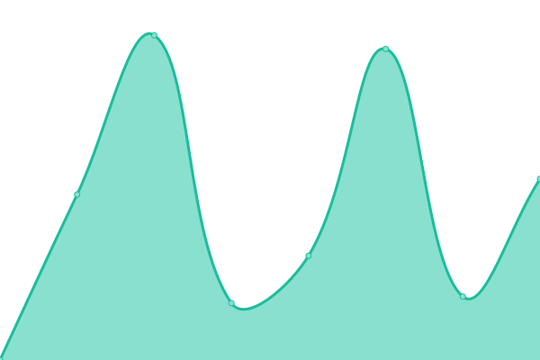 2669ms
     
 | 

<a href="https://uptimereports.github.io/iwebup/history/livemeaningfully-net">31.26%</a>
    

|  [locksmithrightnow.com](https://locksmithrightnow.com) | 🟩 Up | [locksmithrightnow-com.yml](https://github.com/uptimereports/iwebup/commits/HEAD/history/locksmithrightnow-com.yml) | 

 383ms
     
 | 

<a href="https://uptimereports.github.io/iwebup/history/locksmithrightnow-com">100.00%</a>
    

|  [louisthecoinbook.com](https://louisthecoinbook.com) | 🟩 Up | [louisthecoinbook-com.yml](https://github.com/uptimereports/iwebup/commits/HEAD/history/louisthecoinbook-com.yml) | 

 1554ms
     
 | 

<a href="https://uptimereports.github.io/iwebup/history/louisthecoinbook-com">100.00%</a>
    

|  [morecooljustice.com](https://morecooljustice.com) | 🟩 Up | [morecooljustice-com.yml](https://github.com/uptimereports/iwebup/commits/HEAD/history/morecooljustice-com.yml) | 

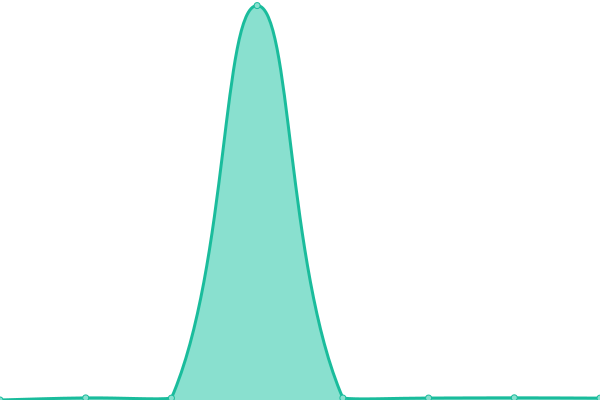 162ms
     
 | 

<a href="https://uptimereports.github.io/iwebup/history/morecooljustice-com">100.00%</a>
    

|  [munsonhof.com](https://munsonhof.com) | 🟩 Up | [munsonhof-com.yml](https://github.com/uptimereports/iwebup/commits/HEAD/history/munsonhof-com.yml) | 

 351ms
     
 | 

<a href="https://uptimereports.github.io/iwebup/history/munsonhof-com">100.00%</a>
    

|  [nancygorenbusinesslaw.com](https://nancygorenbusinesslaw.com) | 🟩 Up | [nancygorenbusinesslaw-com.yml](https://github.com/uptimereports/iwebup/commits/HEAD/history/nancygorenbusinesslaw-com.yml) | 

 2569ms
     
 | 

<a href="https://uptimereports.github.io/iwebup/history/nancygorenbusinesslaw-com">99.81%</a>
    

|  [northflgutterservices.com](https://northflgutterservices.com) | 🟩 Up | [northflgutterservices-com.yml](https://github.com/uptimereports/iwebup/commits/HEAD/history/northflgutterservices-com.yml) | 

 470ms
     
 | 

<a href="https://uptimereports.github.io/iwebup/history/northflgutterservices-com">100.00%</a>
    

|  [nrmafla.com](https://nrmafla.com) | 🟩 Up | [nrmafla-com.yml](https://github.com/uptimereports/iwebup/commits/HEAD/history/nrmafla-com.yml) | 

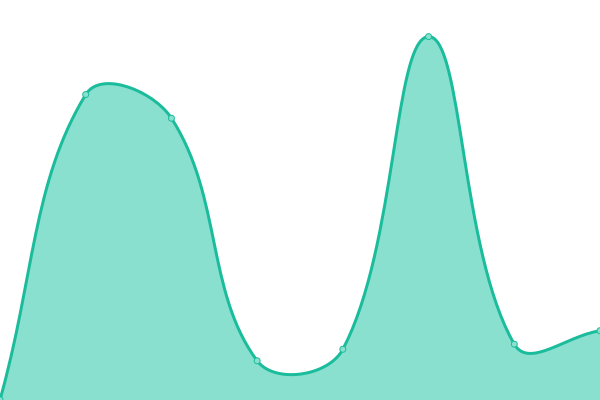 1263ms
     
 | 

<a href="https://uptimereports.github.io/iwebup/history/nrmafla-com">31.26%</a>
    

|  [oakwoodcreditrepair.com](https://oakwoodcreditrepair.com) | 🟩 Up | [oakwoodcreditrepair-com.yml](https://github.com/uptimereports/iwebup/commits/HEAD/history/oakwoodcreditrepair-com.yml) | 

 2065ms
     
 | 

<a href="https://uptimereports.github.io/iwebup/history/oakwoodcreditrepair-com">99.81%</a>
    

|  [ocalasecuritysystems.com](https://ocalasecuritysystems.com) | 🟩 Up | [ocalasecuritysystems-com.yml](https://github.com/uptimereports/iwebup/commits/HEAD/history/ocalasecuritysystems-com.yml) | 

 465ms
     
 | 

<a href="https://uptimereports.github.io/iwebup/history/ocalasecuritysystems-com">100.00%</a>
    

|  [onbudgettreeservice.com](https://onbudgettreeservice.com) | 🟩 Up | [onbudgettreeservice-com.yml](https://github.com/uptimereports/iwebup/commits/HEAD/history/onbudgettreeservice-com.yml) | 

 2190ms
     
 | 

<a href="https://uptimereports.github.io/iwebup/history/onbudgettreeservice-com">99.81%</a>
    

|  [otsmold.com](https://otsmold.com) | 🟩 Up | [otsmold-com.yml](https://github.com/uptimereports/iwebup/commits/HEAD/history/otsmold-com.yml) | 

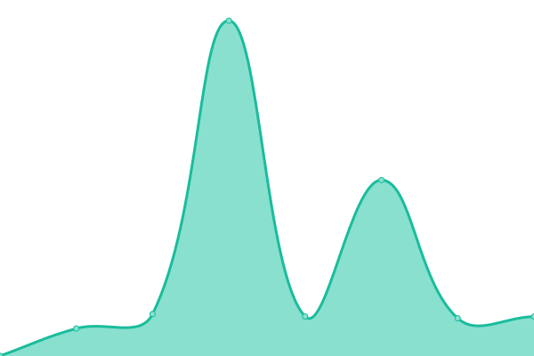 1069ms
     
 | 

<a href="https://uptimereports.github.io/iwebup/history/otsmold-com">99.81%</a>
    

|  [paintersdepotllc.com](https://paintersdepotllc.com) | 🟩 Up | [paintersdepotllc-com.yml](https://github.com/uptimereports/iwebup/commits/HEAD/history/paintersdepotllc-com.yml) | 

 2030ms
     
 | 

<a href="https://uptimereports.github.io/iwebup/history/paintersdepotllc-com">99.81%</a>
    

|  [palmettocomprehensivehealth.com](https://palmettocomprehensivehealth.com/?upptime-test=1) | 🟩 Up | [palmettocomprehensivehealth-com.yml](https://github.com/uptimereports/iwebup/commits/HEAD/history/palmettocomprehensivehealth-com.yml) | 

 1901ms
     
 | 

<a href="https://uptimereports.github.io/iwebup/history/palmettocomprehensivehealth-com">99.81%</a>
    

|  [palmettomedicalinstitute.com](https://palmettomedicalinstitute.com) | 🟩 Up | [palmettomedicalinstitute-com.yml](https://github.com/uptimereports/iwebup/commits/HEAD/history/palmettomedicalinstitute-com.yml) | 

 2205ms
     
 | 

<a href="https://uptimereports.github.io/iwebup/history/palmettomedicalinstitute-com">99.81%</a>
    

|  [partnersinhc.com](https://partnersinhc.com) | 🟩 Up | [partnersinhc-com.yml](https://github.com/uptimereports/iwebup/commits/HEAD/history/partnersinhc-com.yml) | 

 1472ms
     
 | 

<a href="https://uptimereports.github.io/iwebup/history/partnersinhc-com">99.81%</a>
    

|  [pebblecreekindigo8.com](https://pebblecreekindigo8.com) | 🟩 Up | [pebblecreekindigo8-com.yml](https://github.com/uptimereports/iwebup/commits/HEAD/history/pebblecreekindigo8-com.yml) | 

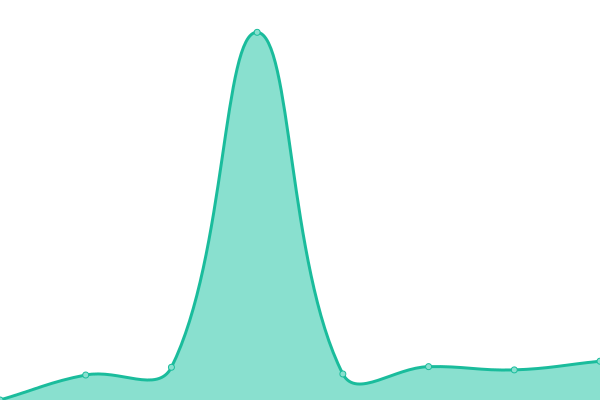 1904ms
     
 | 

<a href="https://uptimereports.github.io/iwebup/history/pebblecreekindigo8-com">99.81%</a>
    

|  [peteandersenpi.com](https://peteandersenpi.com) | 🟩 Up | [peteandersenpi-com.yml](https://github.com/uptimereports/iwebup/commits/HEAD/history/peteandersenpi-com.yml) | 

 2100ms
     
 | 

<a href="https://uptimereports.github.io/iwebup/history/peteandersenpi-com">99.81%</a>
    

|  [petescarpentryandtile.com](https://petescarpentryandtile.com) | 🟩 Up | [petescarpentryandtile-com.yml](https://github.com/uptimereports/iwebup/commits/HEAD/history/petescarpentryandtile-com.yml) | 

 1960ms
     
 | 

<a href="https://uptimereports.github.io/iwebup/history/petescarpentryandtile-com">99.81%</a>
    

|  [quicksmithlocksmiths.com](https://quicksmithlocksmiths.com) | 🟩 Up | [quicksmithlocksmiths-com.yml](https://github.com/uptimereports/iwebup/commits/HEAD/history/quicksmithlocksmiths-com.yml) | 

 335ms
     
 | 

<a href="https://uptimereports.github.io/iwebup/history/quicksmithlocksmiths-com">100.00%</a>
    

|  [rsvprobin.com](https://rsvprobin.com) | 🟩 Up | [rsvprobin-com.yml](https://github.com/uptimereports/iwebup/commits/HEAD/history/rsvprobin-com.yml) | 

 2318ms
     
 | 

<a href="https://uptimereports.github.io/iwebup/history/rsvprobin-com">99.81%</a>
    

|  [santiinternalmedicine.com](https://santiinternalmedicine.com) | 🟩 Up | [santiinternalmedicine-com.yml](https://github.com/uptimereports/iwebup/commits/HEAD/history/santiinternalmedicine-com.yml) | 

 2264ms
     
 | 

<a href="https://uptimereports.github.io/iwebup/history/santiinternalmedicine-com">99.81%</a>
    

|  [schnapf.com](https://schnapf.com) | 🟩 Up | [schnapf-com.yml](https://github.com/uptimereports/iwebup/commits/HEAD/history/schnapf-com.yml) | 

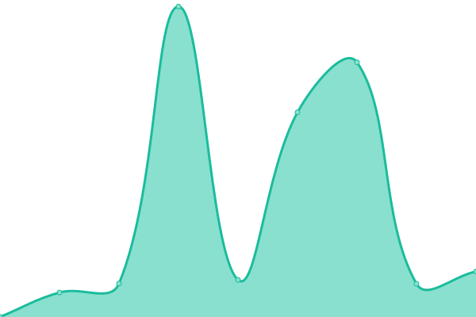 649ms
     
 | 

<a href="https://uptimereports.github.io/iwebup/history/schnapf-com">99.81%</a>
    

|  [seniorsreverse.net](https://seniorsreverse.net) | 🟩 Up | [seniorsreverse-net.yml](https://github.com/uptimereports/iwebup/commits/HEAD/history/seniorsreverse-net.yml) | 

 3001ms
     
 | 

<a href="https://uptimereports.github.io/iwebup/history/seniorsreverse-net">99.81%</a>
    

|  [shearimagesny.com](https://shearimagesny.com) | 🟩 Up | [shearimagesny-com.yml](https://github.com/uptimereports/iwebup/commits/HEAD/history/shearimagesny-com.yml) | 

 2092ms
     
 | 

<a href="https://uptimereports.github.io/iwebup/history/shearimagesny-com">99.81%</a>
    

|  [stmattocalafl.org](https://stmattocalafl.org) | 🟩 Up | [stmattocalafl-org.yml](https://github.com/uptimereports/iwebup/commits/HEAD/history/stmattocalafl-org.yml) | 

 2009ms
     
 | 

<a href="https://uptimereports.github.io/iwebup/history/stmattocalafl-org">99.81%</a>
    

|  [taxvault.net](https://taxvault.net) | 🟩 Up | [taxvault-net.yml](https://github.com/uptimereports/iwebup/commits/HEAD/history/taxvault-net.yml) | 

 2636ms
     
 | 

<a href="https://uptimereports.github.io/iwebup/history/taxvault-net">99.81%</a>
    

|  [techsuranceai.com](https://techsuranceai.com) | 🟩 Up | [techsuranceai-com.yml](https://github.com/uptimereports/iwebup/commits/HEAD/history/techsuranceai-com.yml) | 

 1897ms
     
 | 

<a href="https://uptimereports.github.io/iwebup/history/techsuranceai-com">99.81%</a>
    

|  [thegratefulgardener.org](https://thegratefulgardener.org) | 🟩 Up | [thegratefulgardener-org.yml](https://github.com/uptimereports/iwebup/commits/HEAD/history/thegratefulgardener-org.yml) | 

 2110ms
     
 | 

<a href="https://uptimereports.github.io/iwebup/history/thegratefulgardener-org">99.81%</a>
    

|  [therealestateschoolfl.com](https://therealestateschoolfl.com) | 🟩 Up | [therealestateschoolfl-com.yml](https://github.com/uptimereports/iwebup/commits/HEAD/history/therealestateschoolfl-com.yml) | 

 2229ms
     
 | 

<a href="https://uptimereports.github.io/iwebup/history/therealestateschoolfl-com">99.81%</a>
    

|  [thespeechcoach.net](https://thespeechcoach.net) | 🟩 Up | [thespeechcoach-net.yml](https://github.com/uptimereports/iwebup/commits/HEAD/history/thespeechcoach-net.yml) | 

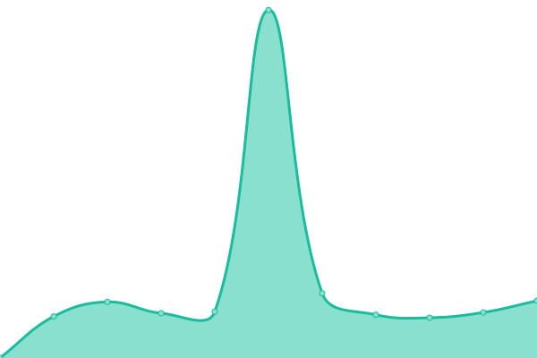 3629ms
     
 | 

<a href="https://uptimereports.github.io/iwebup/history/thespeechcoach-net">99.41%</a>
    

|  [thevillagesandocalahomes.com](https://thevillagesandocalahomes.com) | 🟩 Up | [thevillagesandocalahomes-com.yml](https://github.com/uptimereports/iwebup/commits/HEAD/history/thevillagesandocalahomes-com.yml) | 

 491ms
     
 | 

<a href="https://uptimereports.github.io/iwebup/history/thevillagesandocalahomes-com">100.00%</a>
    

|  [thewheeleragency.com](https://thewheeleragency.com) | 🟩 Up | [thewheeleragency-com.yml](https://github.com/uptimereports/iwebup/commits/HEAD/history/thewheeleragency-com.yml) | 

 2406ms
     
 | 

<a href="https://uptimereports.github.io/iwebup/history/thewheeleragency-com">99.81%</a>
    

|  [urban2urbandevelopmentgroup.com](https://urban2urbandevelopmentgroup.com) | 🟩 Up | [urban2urbandevelopmentgroup-com.yml](https://github.com/uptimereports/iwebup/commits/HEAD/history/urban2urbandevelopmentgroup-com.yml) | 

 1876ms
     
 | 

<a href="https://uptimereports.github.io/iwebup/history/urban2urbandevelopmentgroup-com">99.81%</a>
    

|  [urban2urbanhomes.com](https://urban2urbanhomes.com) | 🟩 Up | [urban2urbanhomes-com.yml](https://github.com/uptimereports/iwebup/commits/HEAD/history/urban2urbanhomes-com.yml) | 

 3226ms
     
 | 

<a href="https://uptimereports.github.io/iwebup/history/urban2urbanhomes-com">31.26%</a>
    

|  [urbanlasalon.com](https://urbanlasalon.com) | 🟩 Up | [urbanlasalon-com.yml](https://github.com/uptimereports/iwebup/commits/HEAD/history/urbanlasalon-com.yml) | 

 7961ms
     
 | 

<a href="https://uptimereports.github.io/iwebup/history/urbanlasalon-com">99.48%</a>
    

|  [volusiaclassifieds.com](https://volusiaclassifieds.com) | 🟩 Up | [volusiaclassifieds-com.yml](https://github.com/uptimereports/iwebup/commits/HEAD/history/volusiaclassifieds-com.yml) | 

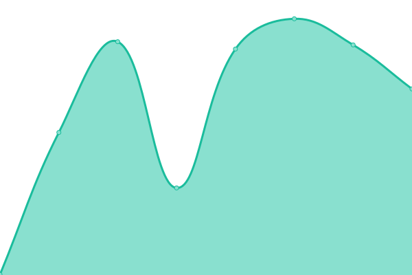 403ms
     
 | 

<a href="https://uptimereports.github.io/iwebup/history/volusiaclassifieds-com">100.00%</a>
    

|  [wecarebidet.com](https://wecarebidet.com) | 🟩 Up | [wecarebidet-com.yml](https://github.com/uptimereports/iwebup/commits/HEAD/history/wecarebidet-com.yml) | 

 2347ms
     
 | 

<a href="https://uptimereports.github.io/iwebup/history/wecarebidet-com">99.81%</a>
    

|  [westcoasthairdesign.com](https://westcoasthairdesign.com) | 🟩 Up | [westcoasthairdesign-com.yml](https://github.com/uptimereports/iwebup/commits/HEAD/history/westcoasthairdesign-com.yml) | 

 583ms
     
 | 

<a href="https://uptimereports.github.io/iwebup/history/westcoasthairdesign-com">100.00%</a>
    

|  [youfirstaesthetics.com](https://youfirstaesthetics.com) | 🟩 Up | [youfirstaesthetics-com.yml](https://github.com/uptimereports/iwebup/commits/HEAD/history/youfirstaesthetics-com.yml) | 

 1907ms
     
 | 

<a href="https://uptimereports.github.io/iwebup/history/youfirstaesthetics-com">90.48%</a>
    

|  [yourmwsalon.com](https://yourmwsalon.com) | 🟩 Up | [yourmwsalon-com.yml](https://github.com/uptimereports/iwebup/commits/HEAD/history/yourmwsalon-com.yml) | 

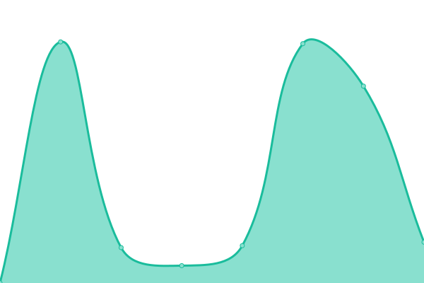 627ms
     
 | 

<a href="https://uptimereports.github.io/iwebup/history/yourmwsalon-com">99.81%</a>
    

|  [zoomlocksmithnow.com](https://zoomlocksmithnow.com) | 🟩 Up | [zoomlocksmithnow-com.yml](https://github.com/uptimereports/iwebup/commits/HEAD/history/zoomlocksmithnow-com.yml) | 

 1723ms
     
 | 

<a href="https://uptimereports.github.io/iwebup/history/zoomlocksmithnow-com">99.81%</a>
    

|  [flmarineelectric.com](https://flmarineelectric.com) | 🟩 Up | [flmarineelectric-com.yml](https://github.com/uptimereports/iwebup/commits/HEAD/history/flmarineelectric-com.yml) | 

 636ms
     
 | 

<a href="https://uptimereports.github.io/iwebup/history/flmarineelectric-com">99.81%</a>
    

|  [jeffersonmorleybooks.com](https://jeffersonmorleybooks.com) | 🟩 Up | [jeffersonmorleybooks-com.yml](https://github.com/uptimereports/iwebup/commits/HEAD/history/jeffersonmorleybooks-com.yml) | 

 3691ms
     
 | 

<a href="https://uptimereports.github.io/iwebup/history/jeffersonmorleybooks-com">99.81%</a>
    

|  [daytonamedspa.com](https://daytonamedspa.com) | 🟩 Up | [daytonamedspa-com.yml](https://github.com/uptimereports/iwebup/commits/HEAD/history/daytonamedspa-com.yml) | 

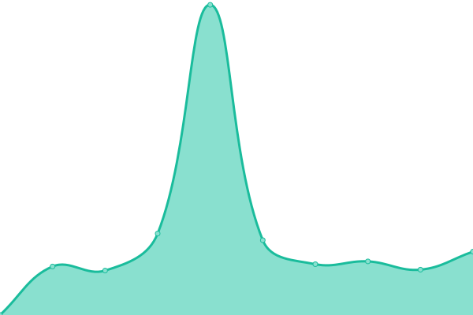 2793ms
     
 | 

<a href="https://uptimereports.github.io/iwebup/history/daytonamedspa-com">99.81%</a>
    

|  [writersridge.com](https://writersridge.com) | 🟩 Up | [writersridge-com.yml](https://github.com/uptimereports/iwebup/commits/HEAD/history/writersridge-com.yml) | 

 336ms
     
 | 

<a href="https://uptimereports.github.io/iwebup/history/writersridge-com">100.00%</a>
    

|  [wgthauling.com](https://wgthauling.com) | 🟩 Up | [wgthauling-com.yml](https://github.com/uptimereports/iwebup/commits/HEAD/history/wgthauling-com.yml) | 

 559ms
     
 | 

<a href="https://uptimereports.github.io/iwebup/history/wgthauling-com">100.00%</a>
    

|  [airheadac.com](https://airheadac.com) | 🟩 Up | [airheadac-com.yml](https://github.com/uptimereports/iwebup/commits/HEAD/history/airheadac-com.yml) | 

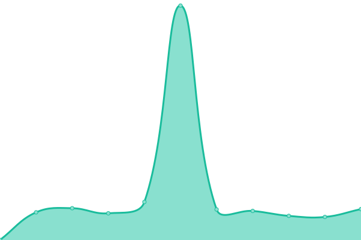 3902ms
     
 | 

<a href="https://uptimereports.github.io/iwebup/history/airheadac-com">99.10%</a>
    

|  [kelvinleeplastering.com](https://kelvinleeplastering.com) | 🟩 Up | [kelvinleeplastering-com.yml](https://github.com/uptimereports/iwebup/commits/HEAD/history/kelvinleeplastering-com.yml) | 

 2035ms
     
 | 

<a href="https://uptimereports.github.io/iwebup/history/kelvinleeplastering-com">99.81%</a>
    

|  [pinkpainterspro.com](https://pinkpainterspro.com) | 🟩 Up | [pinkpainterspro-com.yml](https://github.com/uptimereports/iwebup/commits/HEAD/history/pinkpainterspro-com.yml) | 

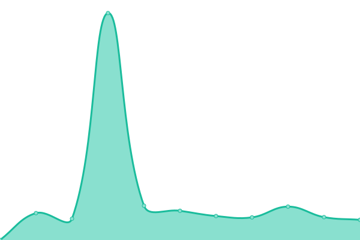 6076ms
     
 | 

<a href="https://uptimereports.github.io/iwebup/history/pinkpainterspro-com">99.43%</a>
    

<!--end: status pages-->

[**Visit our status website →**](https://uptimereports.github.io/iwebup)

## 📄 License

- Powered by: [Upptime](https://github.com/upptime/upptime)
- Code: [MIT](./LICENSE) © [Anand Chowdhary](https://anandchowdhary.com), supported by [Pabio](https://pabio.com)
- Data in the `./history` directory: [Open Database License](https://opendatacommons.org/licenses/odbl/1-0/)
